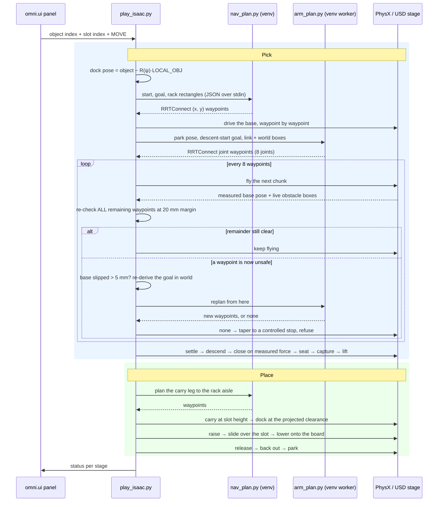

<h1 align="center">MORPH — Isaac Sim</h1>

<p align="center">
  <strong>Autonomous pick-and-place for the MORPH-I mobile manipulator, on NVIDIA Isaac Sim and PhysX.</strong>
</p>

<p align="center">
  
  
  
  
  
  
</p>

<p align="center"><em>▶ Navigate to a scattered object, grasp it, carry it to the rack, and place it on an assigned shelf slot — one button.</em></p>

https://github.com/user-attachments/assets/059d786e-839b-4b67-9591-12fefacb46d0

*One uncut cycle to a low slot: scatter, plan, dock, descend, close on measured force, lift, carry, insert, release, park.*

---

## ✨ Highlights

<table>
  <tr>
    <td align="center" width="33%">
      <strong>🌍 World — MJCF → OpenUSD</strong><br><br>
      <sub>A complete market scene — racks, shelves, textured products, marble floor — converted to a USD package and re-authored so it loads correctly under PhysX. Every converter artifact is a named, documented fixup.</sub>
    </td>
    <td align="center" width="33%">
      <strong>🤖 Robot — 98 DOFs, one articulation</strong><br><br>
      <sub>Mecanum base, dual parallel-linkage arms, two three-finger grippers. The closed kinematic loop a USD articulation cannot express is re-authored as a PhysX joint and held on its closure manifold every step.</sub>
    </td>
    <td align="center" width="33%">
      <strong>🚙 Base — OMPL planned</strong><br><br>
      <sub>RRTConnect <code>(x, y)</code> planning against the real rack footprints, with validated stand-off poses beside the target and a yaw-invariant dock.</sub>
    </td>
  </tr>
  <tr>
    <td align="center" width="33%">
      <strong>🦾 Arm — planned, not animated</strong><br><br>
      <sub>RRTConnect over the eight actuated joints, collision-checked against oriented link boxes read live from the scene, with the four-bar closure supplied at every state. Replanned at every checkpoint against the base pose actually achieved.</sub>
    </td>
    <td align="center" width="33%">
      <strong>🤏 Hand — closes on measured force</strong><br><br>
      <sub>No weld, no attachment. Each finger advances on its own measured pad load and gap until all three latch, and Coulomb contact carries the object through lift, transport and shelf insert.</sub>
    </td>
    <td align="center" width="33%">
      <strong>🛡 Refuses rather than guesses</strong><br><br>
      <sub>Planned motions and open-loop ramps clear a 20 mm margin before anything is commanded, and a check that cannot be evaluated refuses rather than passes. When the geometry says no, the stage stops — object still held — rather than forcing a pose.</sub>
    </td>
  </tr>
</table>

> **What is simulated, stated plainly.** A PhysX articulation stepped at 240 Hz, with the grasp decided by measured geometry and measured contact rather than an animation curve — whenever the fingers hold a real object they run on force-limited drives, so contact can stop them. The arm chain is commanded kinematically, its passive linkage joints held on the closure manifold every step; the reference MuJoCo build reached the same conclusion, because these columns are stiff enough that drive-only tracking sits well off target.

> **The base drives itself where a payload is at stake.** The carry to the rack, the dock snap, the dock leg and the retreat all run on the mecanum drives — 20 Nm hubs through the wheel mixer, capped at 0.5 m/s, corrected against the measured chassis pose every step. That is not decoration: a root pose write resets the contact state and drops a friction-held object, so with the object in hand there are none. The empty-handed approach to the pick is positioned directly instead, which is what makes the dock deterministic and the grasp geometry repeatable.

> **Closed-loop, not replayed.** The approach servos on the *measured* object pose, the close on *measured* pad load and gap, the insert on the *measured* turret angle, the placement height on the *measured* object height. Every stage that can drift has an instrument watching it and a guard that stops it.

> **Two motion primitives, one import.** Arm motion has a public surface of exactly two calls — `move_to_pose`, planned and collision-checked with the replanning above, and `move_linear`, a straight line validated whole before it runs. The hand has four: `move_gripper`, `open_gripper`, `close_gripper`, `hold_gripper`. Task code — pick, place, close, align — imports `morph/arm/api.py` and `morph/gripper/api.py` and nothing deeper, so a motion fixed once is fixed for every stage that moves that way.

> **The world is regenerable, not hand-built.** Everything in `usd/` is baked from the reference model by offline tooling, so scene changes flow through instead of being re-modelled by hand.

---

## 📑 Table of Contents

- [Quick Start](#-quick-start)
- [Run Your First Cycle](#-run-your-first-cycle)
- [The Control Panel](#-the-control-panel)
- [Video Demos](#-video-demos)
- [The Grasp](#-the-grasp)
- [How It Works](#-how-it-works)
- [Project Layout](#-project-layout)
- [Environment Variables](#-environment-variables)
- [Verifying a Run](#-verifying-a-run)
- [Reference Manual](#-reference-manual)
- [Troubleshooting](#-troubleshooting)
- [FAQ](#-faq)
- [Scope & Status](#-scope--status)
- [Acknowledgements](#-acknowledgements)

---

## 🚀 Quick Start

Two interpreters are involved, and it is worth being clear about why before installing anything.
Isaac Sim ships its own Python, and that is what runs the simulation. It has no OMPL bindings, so
the path planner runs as a subprocess in a **separate** Python 3.10 environment.

| Interpreter | Runs | Install |
| --- | --- | --- |
| Isaac Sim's bundled `python.sh` | `play_isaac.py`, `scene.py` | Comes with Isaac Sim — nothing to add |
| A Python 3.10 virtualenv | `nav_plan.py` and `arm_plan.py` (OMPL) | `requirements.txt` |

<details>
<summary><strong>1. Isaac Sim (required — install this first)</strong></summary>

> **Isaac Sim is a prerequisite, not a dependency of this repository.** It is a separate NVIDIA
> application: it is not bundled here and it cannot be installed with
> `pip install -r requirements.txt`. Nothing in this repository runs until Isaac Sim is on the
> machine.

Download the **Isaac Sim 6.0.1 standalone** Linux build from the
[NVIDIA Isaac Sim download page](https://developer.nvidia.com/isaac-sim) — the asset is
`isaac-sim-standalone-6.0.1-linux-x86_64`. Unpack it anywhere; everything below assumes:

```bash
export ISAAC=~/isaac-sim        # the unpacked folder, the one containing python.sh
```

Verify before going further:

```bash
"$ISAAC/python.sh" -c "import isaacsim; print('Isaac Sim OK')"
```

**Requirements**

| | |
| --- | --- |
| **Version** | **Isaac Sim 6.0.1** — the version this project is developed and tested against |
| GPU | RTX-capable NVIDIA GPU with a current driver — PhysX and RTX rendering both need it |
| OS | Ubuntu 22.04 |
| Disk | ~30 GB for Isaac Sim, plus room for the first-run RTX shader cache |

> **Why the version matters.** The scene is authored against the PhysX articulation and OpenUSD
> APIs shipped in the 6.0.x line. Other 6.0.x releases will most likely work; **4.x and 5.x will
> not** — several of the APIs used here were moved or renamed.
</details>

<details>
<summary><strong>2. The OMPL planner environment</strong></summary>

```bash
python3.10 -m venv .venv
.venv/bin/pip install -r requirements.txt
```

> **Why Python 3.10?** OMPL is distributed as a wheel compiled for specific Python versions, and
> those wheels are built against the NumPy 1.x ABI — hence the pinned `numpy==1.26.4`.

Verify:

```bash
.venv/bin/python3 -c "from ompl import geometric; print('OMPL OK')"
```
</details>

<details>
<summary><strong>3. Launch</strong></summary>

```bash
git clone https://github.com/obotx/nvidia-isaac-sim-openusd.git
cd nvidia-isaac-sim-openusd

./run_gui.sh
```

`run_gui.sh` points `OMPL_PYTHON` at `./.venv` and wraps the launch in a boot watchdog — Kit
occasionally deadlocks during initialisation after an abrupt exit, and a retry boots cleanly.
Override `ISAAC` if Isaac Sim is not at `~/isaac-sim`.

To launch without the wrapper:

```bash
OMPL_PYTHON=$PWD/.venv/bin/python3 "$ISAAC/python.sh" play_isaac.py
```

First launch takes a few minutes while Isaac compiles RTX shaders. Later launches are quick.
</details>

---

## 🎯 Run Your First Cycle

Once the viewport is up and the **MORPH Pick & Place** panel has appeared in the corner:

| # | Action | What you should see |
| :-: | --- | --- |
| **1** | **Wait** for the scene to finish loading | Market aisle, racks, textured products, ten cylinders scattered on the floor |
| **2** | **Check the arms** | Both held in the PARK pose, level and clear of the chassis — not sagging |
| **3** | **Choose an object** in the `Object` field | `0`–`9`, one per scattered cylinder |
| **4** | **Choose a shelf slot** in the `Shelf slot` field | `0`–`9`, labelled low / mid / high with their height in metres |
| **5** | **Press `MOVE`** | The terminal prints an `OMPL` plan and a waypoint count |
| **6** | **Watch the cycle** | Drive to the object → descend → close → lift → carry to the rack → dock → raise, slide over the slot, lower → release → back out → park |
| **7** | **Read the terminal** | Each stage prints a `>>>` line with the numbers behind it |

> 💡 **Every run is a different layout, and every run is reproducible.** The ten cylinders are
> scattered from a fresh random seed unless you pin one, and the run prints the seed it drew:
> `>>> scattered 10 objects (seed=417)`. Pass it back as `SEED=417` to replay that exact layout.

> 💡 **Tip:** The panel's controls are described in [The Control Panel](#-the-control-panel),
> along with the camera bindings.

Headless, for a scripted run with no window:

```bash
ISAAC_HEADLESS=1 SEED=0 DEMO_CYCLES="3:6" \
  OMPL_PYTHON=$PWD/.venv/bin/python3 "$ISAAC/python.sh" play_isaac.py
```

`DEMO_CYCLES` takes a comma-separated list of `object:slot` pairs — `"3:6,0:1,5:8"` runs three
cycles back to back in a single boot.

---

## 🎛 The Control Panel

One panel drives the whole cycle: pick an object, pick a shelf slot, press **MOVE**.

<p align="center">
  
</p>

| Control | What it does |
| --- | --- |
| **Object** | Which of the ten scattered cylinders to fetch. Indices follow the scatter, so the same index is a different cylinder under a different `SEED`. |
| **Shelf slot** | Where to put it — ten slots across three heights, each labelled with its level and height. |
| **MOVE** | Runs the full cycle with the two selections. Ignored while a cycle is already running. |
| **status** | The current stage, mirrored from the terminal: `nav to object 0` → `reaching` → `closing gripper` → `carrying to slot 4` → `placing` → `done`. A refusal shows here too. |

`Obj-0` … `Obj-9` fill the object dropdown. The slot dropdown carries each slot's level and
height, built from the slot table in `morph/config.py` — the same numbers the carry height and the
insert are derived from, so the label and the motion can never disagree:

```
Slot-0  (low z=0.25m)     Slot-4  (mid z=0.69m)     Slot-7  (high z=1.19m)
Slot-1  (low z=0.25m)     Slot-5  (mid z=0.69m)     Slot-8  (high z=1.19m)
Slot-2  (low z=0.25m)     Slot-6  (mid z=0.69m)     Slot-9  (high z=1.19m)
Slot-3  (low z=0.25m)
```

The window opens at 380 × 300, which is everything above. **Scroll the panel with the wheel** —
or drag its lower edge down — and the manual controls follow.

### Driving it by hand

Jog is for checking reach and grasp by hand. None of it runs during a cycle, and each control
starts from the pose the robot is already in, so arming it commands no motion at all.

<p align="center">
  
</p>

**Arm the controls first.** The button reads `JOG: OFF` until you press it, then `JOG: ON`, and
every control below is inert until it does. Press it again to hand the arm back.

<p align="center">
  
</p>

**Arm — X / Y / Z.** Three ±1.0 m sliders that move the gripper relative to where jog was
engaged, in metres. The servo drives the columns, the boom and the turret to put the hand there,
and clips every joint at its own stop — so a target outside the envelope parks the servo rather
than forcing anything.

<p align="center">
  
</p>

**Base — the joystick.** Push the inner stick and the chassis drives that way at up to 0.6 m/s in
its own frame, for as long as you hold it; let go and it springs back to centre and stops. Drag
the outer ring and the chassis turns to face that way at 0.6 rad/s. It is a velocity, not a
destination, which is what lets the mecanum wheels roll through the motion instead of jumping to
the end of it.

<p align="center">
  
</p>

**Gripper — grip.** 0 holds the hand as it was when jog was engaged, 1 is a full finger curl, and
the fingers interpolate between them. A position command, not a grasp: the automatic cycle closes
on measured pad force instead, and this slider will squeeze whatever is between the fingers rather
than stopping on contact.

https://github.com/user-attachments/assets/ce22ab07-18fe-4c53-bb1d-1f6894826db2

*Arming the jog, the arm sliders, the base joystick and the gripper curl.*

### Moving the camera

| Action | Mouse |
| --- | --- |
| **Orbit** | Left-click + drag |
| **Pan** | Right-click + drag |
| **Zoom** | Scroll wheel |

Keeping the camera still during a run makes the planned path much easier to follow.

---

## 🎥 Video Demos

Every recording is one uncut cycle at real time — nothing is sped up, cut or stitched. The low
slot is at the top of this README; the rest cover the other two heights and the editor view.

### Mid slot

https://github.com/user-attachments/assets/97e494f6-5098-4774-b724-ccc197ba58ae

*A different object and a mid-height slot: the carry rides at slot height and the insert slides
over the board rather than dropping onto it.*

### High slot

https://github.com/user-attachments/assets/e9ff8f47-b569-42cb-8472-88e4d6d6267e

*The high slots are where the reach is tightest — the place dock is solved from the chassis
plate's projected reach so the arm still clears the board above.*

### In the Isaac Sim editor

The same cycles with the editor left open, so the stage tree, the property panel and the physics
scene are visible around the viewport: this is a live PhysX articulation being stepped, not a
rendered clip.

https://github.com/user-attachments/assets/b0b45937-7c96-492b-b57b-63887c1bc942

*Mid slot, editor visible.*

https://github.com/user-attachments/assets/e47a9b76-1fbe-4c26-9c02-cc2f720a035c

*High slot, editor visible.*

---

## 🤏 The Grasp

**Nothing holds the object but friction.** There is no weld, no attachment and no kinematic
constraint at any point in the cycle — the 1+2 asymmetric gripper closes on the cylinder and
Coulomb contact between the pads and the surface carries it through the lift, the transport and
the shelf insert. This is the only mode; there is no switch.

The close servos each finger on its own measured pad load and gap until all three latch on force,
which is what makes the grasp reproducible rather than tuned to one object pose:

| Measured on one full cycle | Value |
| --- | --- |
| Object displacement during the close | 1 mm |
| In-hand slip across the whole carry | 0.2 mm |
| In-hand slip at release, after the shelf insert | 1.7 mm |
| Object tilt at release | 0.9° off-vertical |
| Final placement error on the slot | 3 mm in xy, 2 mm in z |

Not tuned to one layout: over nine consecutive random scatters, eight ran the full cycle to a
graded `precise_success` at a median final error of **5 mm**. The ninth was refused at the
clearance gate and stopped with the object still held — the designed refuse-rather-than-force
behaviour, working.

### The contact, in numbers

The close is not a scripted stroke — it stops when the measured load says it may. One cycle's
forces, as the run printed them:

| Quantity | Measured |
| --- | --- |
| Object mass | 0.724 kg — a weight of 7.1 N to hold |
| Normal load, thumb `a` / side `b` / side `c` | 10.2 / 8.5 / 8.1 N at the end of the close |
| Total joint reaction carrying the object | 38.1 N |
| Finger drive torque, thumb / sides | 1.45 / 0.84 / 0.84 N·m |
| Thumb opposition to the two side fingers | 168° (a force-closure triad, not a pinch) |

27 N of normal load against a 7.1 N weight, opposed in a triad rather than squeezing one axis —
which is why the object moves 0.2 mm across the whole transport.

What decides a grasp here is the approach, not the squeeze. Docking 40 mm farther out loads one
pad instead of three: 232 N of reaction and the object shoved 25 mm rather than held. That is why
the descent, the alignment and the close all run closed-loop on measured geometry.

### What the hand is built to hold

**This hand is sized for one class of object: an 80 × 180 mm cylinder.** The envelope is set by
the hand, not by a setting — wider and the knuckles meet the object before the pads do; narrower
and the pads sweep past the surface and close on each other.

`OBJ_RADIUS` and `OBJ_HALF_H` re-state that geometry, and the descent, close and insert all derive
from them rather than from baked numbers. Going outside the envelope is a **gripper** question — a
different hand or a different grasp strategy — and this repository does not claim otherwise.

A prior weld-based hold — a PhysX `FixedJoint` applied once the close completed — was removed
after the friction grasp completed the cycle to every shelf level. A weld proves nothing about
whether the fingers ever reached a pose that could hold the object.

---

## 🧠 How It Works

### Pipeline overview



**On replanning.** A plan is a hypothesis about a world that has since moved. Every eight
waypoints the planned reach re-reads the obstacle boxes off the live stage, re-measures the base,
and re-checks *all* remaining waypoints — not just the next one — at the 20 mm margin. Still
clear, it keeps flying. Not clear, it replans from the current configuration; and if the base has
slipped more than 5 mm the goal is re-derived in world first, because the arm rides the base and
stale joint targets aim at where the object used to be. No new plan means a tapered stop and a
refusal, never a forced pose.

Straight-line moves — the insert ramps, the retreat — are the deliberate exception: validated
whole before they start, and halted at the last cleared pose rather than replanned, because a line
that curves around an obstacle is no longer the line the caller asked for.

### Component responsibilities

| Module | Role |
| --- | --- |
| `play_isaac.py` | Entry point. Boots `SimulationApp`, composes `Demo` from the mixins below, owns `main()`. Nothing else. |
| `scene.py` | Scene library. Loads the USD package, applies the load-time fixups below, sets drive gains, closes the arm linkage, applies the PARK pose. |
| `nav_plan.py` | The base planner. Reads a JSON request on stdin, plans `(x, y)` with OMPL RRTConnect against inflated rack rectangles, writes waypoints to stdout. Yaw is the follower's, blended to the dock heading over the final metre. |
| `arm_plan.py` | The arm planner. Same contract and interpreter as `nav_plan.py`, over the eight actuated arm joints: RRTConnect against oriented link boxes, the closure domain and obstacle boxes supplied by the caller. The simulator runs it as one persistent worker (`--loop`, one request per line, each answer tagged with the request's id) so spawn and import are paid once; the offline tools drive its one-shot mode. |
| `morph/config.py` | Sole owner of the scene constants, the reference grasp, the shelf and dock geometry and the object scatter. Every other module reads them from here. |
| `morph/geometry.py` | Pure quaternion and rotation maths. No Isaac dependency — run `python3 morph/geometry.py` for its self-check. |
| `morph/robot.py` | The write primitives: the base ledger, `set_base`, the joint command paths, the drive gains and the mecanum wheel mixer. Everything else calls these. |
| `morph/kinematics.py` | Frames, forward kinematics, the closure lookup table and the baked reference frames. |
| `morph/arm/` | The arm package; task code imports `api.py` only. `api.py` (the public surface), `plan.py` (the OMPL child, start pose, goal set), `execute.py` (waypoint execution, checkpoints), `stage.py` (obstacle boxes off the USD stage), `obstacles.py` (the deck pad, the padded set, blame), `retreat.py`, `surface.py` (`ArmMixin`), `model.py` (`ArmModel`: FK, IK, closure LUT, `first_hit`), `collision.py` (`MARGIN`, the hand's boxes, the OBB predicates), `cartesian.py`, `timing.py`, `linear.py`. |
| `morph/navigation.py` | OMPL path planning (a subprocess call) and the chassis drive that follows it: planned once against the rack rectangles, then tracked closed-loop on the measured pose — on the wheel drives whenever the object is held. A route it cannot plan is a counted refusal, not a drive-on-anyway. |
| `morph/world.py` | Object scatter, colliders, rack keep-outs, grip material. |
| `morph/align.py` | The alignment servos that bring the hand to the object without moving the object, and the manual jog: the cartesian arm servo, the chassis velocity the joystick commands, and the yaw slew. |
| `morph/gripper/` | The gripper package; task code imports `api.py` only. `api.py` holds `move_gripper`, `open_gripper`, `close_gripper`, `hold_gripper` and `GripperMove`, and re-exports `FingersMixin` and `ForceBalanceStage`; `force_close.py` holds the force-balanced close servo; `fingers.py` holds the finger geometry and contact sensing: pad positions, surface gaps, joint reaction forces. |
| `morph/pick/` | The pick cycle, one module per stage: dock, approach, reach, descend, close, guarded seat, grasp. |
| `morph/close/` | The finger close, one module per stage: alignment, lowest-pose solve, arm ramp. The force close itself is `morph/gripper/force_close.py`, entered through `close_gripper`. |
| `morph/place/` | Carry to the rack, slot insert, release, back out, and the failure recovery. |
| `morph/diagnostics.py` | Reporting only — measures and prints, never changes state. |
| `morph/gui.py` | The `omni.ui` side panel: the object and slot choice, MOVE, the status line, and the manual jog controls for the arm, the base and the gripper. |
| `usd/` | The baked world, and the reference frames and geometry the stages derive their goals from. |

### Design notes

> 🔩 **The arm is a closed kinematic loop.** Each arm is a four-bar parallel linkage. USD
> articulations are trees, so the loop-closing joint cannot live inside one. It is authored as a
> separate PhysX spherical joint marked `excludeFromArticulation`, and the passive links are held
> on the closure manifold each step from a baked table (`usd/_closure_lut.json`). Every arm
> configuration comes off that manifold rather than being interpolated freely — interpolate off it
> and constraint error accumulates until the solver diverges.

> 🎯 **Docking is yaw-invariant.** The grasp configuration is a fixed arm pose, so the object
> always lands at the same point in the robot's base frame. Navigating to `P = O − R(ψ)·LOCAL_OBJ`
> facing `ψ` reproduces that geometry from *any* approach angle, which is what lets the planner
> choose the stand-off freely instead of being pinned to one side.

> 🪝 **The place dock is solved, not fixed.** The base absorbs the angle the turret would
> otherwise swing through, so the arm reaches the slot straight out in front of the robot and stays
> clear of the parked arm. How close it parks comes from the chassis plate's *projected* reach at
> that yaw — a plate meeting the shelf face at an angle reaches farther than its half-width — which
> is what leaves the arm reach to spare at the high slots.

> 🩹 **Load-time fixups (`scene.py`).** The MJCF→USD converter leaves artifacts that make the
> scene unusable as imported. Each is undone at load so the source USD stays regenerable:
> **(1)** jointless world props import as *dynamic* bodies with bad mass and fall through the floor
> → their rigid-body dynamics are disabled; **(2)** inactive grasp welds import as *active* and
> snap every object onto the gripper at frame 0 → deleted; **(3)** the single source light does not
> convert, leaving a black RTX scene → a dome and a sun are added; **(4)** the marble floor texture
> is mapped once and stretched instead of tiled → an explicit tiled quad is authored;
> **(5)** link masses and inertias are dropped → restored from `usd/_link_masses.json`;
> **(6)** the arm sags into the chassis without its linkage equality → the PARK keyframe is applied
> and the loop joint is authored.

---

## 📁 Project Layout

```
nvidia-isaac-sim-openusd/
├── README.md                   # this file
├── requirements.txt            # OMPL planner environment (Python 3.10)
├── run_gui.sh                  # windowed launch with the Kit boot watchdog
├── play_isaac.py               # entry point — bootstrap, Demo composition, panel, main()
├── scene.py                    # scene library — USD load, fixups, gains, PARK pose
├── nav_plan.py                 # OMPL RRTConnect base planner (runs in the venv)
├── arm_plan.py                 # OMPL RRTConnect arm planner over 8 joints (one worker in the venv)
├── smoke_test.py               # fast structural checks, no GPU needed
├── verify_place.py             # verify a place run from its log (const-Z, upright, clearance)
├── tools/                      # generators and benchmarks whose output is committed data
│   ├── extract_arm_model.py        # arm joint tree + link bounds -> usd/_arm_model.json
│   ├── measure_check_gap.py        # collision-checker resolution against the swept motion
│   ├── bench_plan.py               # planner benchmark over a fixed problem set
│   └── bench_problems/             # the problems, with a committed baseline to compare against
├── tests/                      # the offline suites, run in the venv; no GPU needed
│   ├── test_armfk.py               # the arm model against its ground truth
│   ├── test_armfk_live.py          # the arm model vs the live articulation (needs Isaac)
│   ├── test_fallback_counter.py    # every refusal a stage can take is tagged and counted
│   ├── test_insert_guard.py        # the shelf insert's clearance guard
│   └── ...                         # cartesian, timing, goal set, IK repair, place dock, ...
├── assets/                     # screenshots, the panel capture and the demo recordings
├── morph/                      # the application package
│   ├── config.py                   # scene constants, reference grasp, shelf/dock geometry (single owner)
│   ├── rects.py                    # the floor plan: rack and wall rectangles, read by the planner too
│   ├── geometry.py                 # pure quaternion/rotation maths (self-checking)
│   ├── usd_utils.py                # stage/prim lookup
│   ├── robot.py                    # base + articulation write primitives, mecanum mixer
│   ├── kinematics.py               # frames, FK, closure LUT, trajectory player
│   ├── arm/                        # the arm package; task code imports arm/api.py only
│   │   ├── api.py                      # move_to_pose, move_linear, ramp_blocked
│   │   ├── plan.py                     # the OMPL child process, start pose, goal set
│   │   ├── model.py                    # FK, IK, the closure LUT, collision queries
│   │   ├── collision.py                # MARGIN, the hand's boxes, the OBB predicates
│   │   ├── cartesian.py                # straight-line planning
│   │   └── ...                         # execute, stage, obstacles, retreat, timing, linear
│   ├── navigation.py               # OMPL planning + the chassis drive
│   ├── world.py                    # object scatter, colliders, keep-outs
│   ├── align.py                    # the alignment servos
│   ├── gripper/                    # the gripper package; task code imports gripper/api.py only
│   │   ├── api.py                      # move_gripper, open_gripper, close_gripper, hold_gripper, GripperMove, FingersMixin
│   │   ├── force_close.py              # per-finger close on measured pad force (the close servo)
│   │   └── fingers.py                  # finger geometry and contact sensing
│   ├── diagnostics.py              # reporting only
│   ├── gui.py                      # the omni.ui panel
│   ├── pick/                       # the pick cycle, one module per stage
│   │   ├── dock.py                     # dock-angle search, navigation, pre-grasp pose
│   │   ├── approach.py                 # the reach's goal derivation, on top of move_to_pose
│   │   ├── reach.py                    # reach approach — one planned motion, park to descent start
│   │   ├── descend.py                  # settle + fine align
│   │   ├── close_anim.py               # the driven finger close
│   │   ├── guarded_seat.py             # the seat stroke, guarded on measured pad load
│   │   └── grasp.py                    # seat, capture, verify, lift
│   ├── close/                      # the finger close, one module per stage
│   │   ├── approach_align.py           # pre-close XY/Z alignment servos
│   │   ├── lowest.py                   # lowest-pose solves before the forward reach
│   │   └── ramp.py                     # the settling joint-space arm ramp the stages share
│   └── place/                      # the place cycle
│       ├── __init__.py                 # carry, dock, height set, release, back out, park
│       ├── insert.py                   # the slide onto the slot surface
│       └── recover.py                  # failure recovery
└── usd/                        # the baked world, reference frames and geometry
    ├── market_world_m1/            # converted MJCF → USD package
    │   ├── market_world_m1.usda        # root layer, Physics variant set
    │   ├── payloads/                   # geometry, robot, materials, physics
    │   └── Textures/                   # marble floor and product textures
    ├── products_textured.usd       # re-authored product meshes with UVs + labels
    ├── products_tex/               # the product label textures
    ├── _home_keyframe.json         # PARK pose, all 98 joints
    ├── _link_masses.json           # link masses and inertias the converter dropped
    ├── _closure_lut.json           # the four-bar closure manifold, indexed by (dh, a1)
    ├── _arm_model.json             # arm joint tree + per-link bounds, for the arm planner
    ├── _grasp_known.json           # the reference grasp: base pose + arm configuration
    ├── _grasp_close.json           # the recorded finger close
    ├── _traj_reach.json            # reference frames the reach derives its goal from
    ├── _traj_lift.json             # reference frames for the lift
    ├── _traj_place_{low,mid,high}.json  # reference frames per shelf level, incl. the grip base pose
    └── _products.json              # product manifest used during the texture swap
```

> 📄 **On the `usd/` artifacts.** They are baked offline from the reference model by tooling kept
> outside this repository, and committed here so the simulation runs from a clean clone with
> nothing to generate. Treat them as build outputs: read them, do not hand-edit them.

---

## 🧰 Environment Variables

The simulation is driven by environment variables. These are the ones intended for use; the rest
are internal tuning knobs and are not part of the supported surface.

| Variable | Default | Effect |
| --- | --- | --- |
| `OMPL_PYTHON` | `<repo>/.venv/bin/python3` | Interpreter used to run `nav_plan.py` and `arm_plan.py`. `run_gui.sh` sets this for you. |
| `ISAAC_HEADLESS` | `0` | `1` runs with no window and auto-executes a demo cycle. |
| `SEED` | unset (random) | The object scatter. Unset, every run draws a fresh layout and prints the value it drew; pass that value back to replay it. |
| `NAV_SEED` | unset (random); `run_gui.sh` sets `0` | The OMPL base planner. |
| `ARM_SEED` | unset (random); `run_gui.sh` sets `1` | The OMPL arm planner. |
| `DEMO_CYCLES` | — | Headless run list, e.g. `"3:6,0:1"`. Overrides `DEMO_OBJ`/`DEMO_SLOT`. |
| `DEMO_OBJ` / `DEMO_SLOT` | `0` / `0` | Single headless cycle: which object, which shelf slot. |
| `OBJ_RADIUS` / `OBJ_HALF_H` | `0.040` / `0.09` | The graspable cylinder's radius and half-height, in metres — 80 × 180 mm. Read [What the hand is built to hold](#-the-grasp) before changing them. |
| `OBJ_DENSITY` | `800.0` | Density of the graspable cylinder, kg/m³. With the default size this authors a 0.724 kg object, which the run prints at start-up. |
| `NAV_VMAX` / `CARRY_VMAX` | `32.0` / `1.2` | Speed ceilings, m/s, for the positioned base profile and for the carry leg. Ceilings, not cruise speeds, and `32.0` is never approached: the approach gain and a brake sized to stop within the remaining distance both bind first. On wheel drives the run clamps to 0.5 m/s, measured, because the held object feels every transient. |
| `REACH_T` / `LIFT_T` | `2.5` | Duration of the reach and lift motions, in seconds. |
| `LOG_LEVEL` | quiet | `warning` restores Isaac's startup diagnostics, which are muted by default. |

> ⚠️ **All three seeds, or none — and even then, expect millimetres to move.** `SEED`, `NAV_SEED`
> and `ARM_SEED` are independent, and each one left unset is a free variable. Pinning two of three
> and calling two runs comparable is the easy mistake. Pinning all three fixes the layout and the
> plans, not the outcome: the wheel-driven legs are contact dynamics and do not reproduce bitwise,
> so two identical-seed runs land the same grade with different millimetres. Compare verdicts and
> distributions, not one reading against another.

---

## ✅ Verifying a Run

A place run is easy to misjudge by eye — an object can look seated while it is a centimetre off,
and a shelf-board graze is invisible when the object is collision-free. `run_gui.sh` writes the
run to `logs/live.log` (and streams it to the terminal), and `verify_place.py` grades that log:

```bash
./run_gui.sh
python3 verify_place.py logs/live.log
```

| Check | What it asserts |
| --- | --- |
| **const-Z** | Once the height is set for the slot, the object holds it for every waypoint of the slide. |
| **upright** | The object is never meaningfully tilted, at the insert end or at release. |
| **clearance** | The object geometrically fits the opening it slides through, against the real board heights. |
| **arm clearance** | The hand's highest point over the whole slide stays under the board above it. |
| **base drift** | The chassis holds its dock while the arm works, within a fixed band. |
| **final grade** | The placement's own measured xy and z error, read off the stage rather than self-reported. |
| **no NaN** | No stage reported a non-finite measurement, which would make every check above meaningless. |

It also counts every fallback the run took and fails outright on the ones classed as safety.
Exits non-zero, so it gates a visual check rather than replacing one.

`smoke_test.py` is the cheaper gate — it parses the sources without booting Isaac at all, and
catches a method lost or duplicated during a refactor, a name an internal probe imports
disappearing, or the bootstrap ordering being broken:

```bash
python3 smoke_test.py
```

Behind both sits the offline suite under `tests/`, run from the planner venv, no GPU.
They assert on the geometry and the refusals rather than on output text — that a motion which
cannot prove its clearance refuses, that every refusal a stage can take is tagged and counted,
that the insert guard binds, that the arm model matches the live articulation.

```bash
for t in tests/test_*.py; do .venv/bin/python3 "$t"; done
```

`tests/test_armfk_live.py` is the exception: it needs a running Isaac, and fails offline by design.

---

## 📖 Reference Manual

### The scene

An 8 × 8 m market floor with five rack rows. Ten cylinders are scattered on the floor at start-up
according to `SEED`. Ten shelf slots (`0`–`9`) sit on the north face of the middle rack across
three heights — **low** at 0.247 m (slots 0–3), **mid** at 0.687 m (slots 4–6) and **high** at
1.190 m (slots 7–9). The values are transcribed from the source model's slot markers into
`SHELF_SLOTS` in `morph/config.py`, and everything downstream — the panel labels, the carry
height, the insert and its clearance check — is derived from that one table.

### The robot — MORPH-I

98 degrees of freedom under a single articulation rooted at `/World/Geometry/robot`.

| Group | Joints |
| --- | --- |
| **Base** | Mecanum drive — four wheels, roller hinges per wheel |
| **Column** | `ColumnLeftBearingJoint_1`, `ColumnRightBearingJoint_1` — the parallel-linkage pair that sets arm height and tilt |
| **Arm** | `ArmLeftJoint_1` (extension), `BaseJoint_1` (turret yaw) |
| **Wrist** | `HandBearingJoint_1`, `gripper_z_rotation_1`, `gripper_y_rotation_1`, `gripper_x_rotation_1` |
| **Hand** | Three fingers `a`, `b`, `c` × three joints each, plus the `b`/`c` scissor joints |

> **On the two arms.** The robot carries a mirrored pair. Arm 1 does the work; arm 2 stays in PARK.

> **On the hand.** The gripper is *1 thumb opposed to 2 side fingers*, not three symmetric
> fingers, and it is built for an **encompassing** grasp — the object rests against the palm and
> the fingers curl around it. The knuckles gap far less than the objects being grasped, so there
> is no pinch pose to aim at; the close stages exist to get the object inside the circle the
> fingers sweep before curling them.

---

## 🛠 Troubleshooting

### Setup

| Symptom | Cause | Fix |
| --- | --- | --- |
| `ModuleNotFoundError: isaacsim` | Ran with the system Python, or Isaac Sim is not installed | Install Isaac Sim 6.0.1 (step 1), then launch through `"$ISAAC/python.sh"` — never `python3` |
| `ImportError` / `AttributeError` from an `isaacsim.core` or `pxr` symbol at start-up | Isaac Sim 4.x or 5.x — several APIs used here were moved or renamed | Use 6.0.1. Check with `"$ISAAC/python.sh" -c "import isaacsim; print(isaacsim.__version__)"` |
| `python.sh: No such file or directory` | `$ISAAC` points at the wrong directory | It must be the unpacked `isaac-sim-standalone-6.0.1-linux-x86_64` folder, which contains `python.sh` |
| `ModuleNotFoundError: ompl` in the planner subprocess | `OMPL_PYTHON` points at the wrong interpreter | Point it at the venv built from `requirements.txt` |
| `ompl` imports but crashes on a NumPy ABI error | NumPy 2.x in the planner venv | `pip install numpy==1.26.4` — the OMPL wheels need the 1.x ABI |
| `python3.10: command not found` | Python 3.10 not installed | `sudo apt install python3.10 python3.10-venv` |

### Runtime

| Symptom | Cause | Fix |
| --- | --- | --- |
| Black viewport, geometry invisible | RTX shaders still compiling on first launch | Wait — the first boot takes several minutes, later ones do not |
| Launch hangs at "Passing the following args to the base kit application" | Kit deadlocked during initialisation, usually after an abrupt previous exit | Use `./run_gui.sh`, which detects this and retries |
| Navigation reports no plan found | Goal inside an inflated rack footprint | Choose another object, or widen the floor bounds in `nav_plan.py` |
| Arm sags into the chassis at start-up | PARK pose or the linkage closure did not apply | Confirm `usd/_home_keyframe.json` and `usd/_closure_lut.json` are present and unmodified |
| Products render flat and unlabelled | `usd/products_textured.usd` missing from the clone | Re-clone; it is a committed asset, not generated locally |
| The object slips a millimetre or two in the hand during the carry | Expected — the grasp is friction-only, and the release gate allows up to 5 mm | Nothing to do; `verify_place.py` grades the run |

---

## ❓ FAQ

### Why is there a second Python environment just for the planner?

Isaac Sim's bundled interpreter has no OMPL bindings, and OMPL's published wheels are not built
for it. Serialising the planning request to JSON and running the planner in a Python 3.10 process
avoids both vendoring a planner and fighting a binary-compatibility problem. It also keeps the
planner engine-agnostic — the same file plans for the reference MuJoCo build without modification.

### Is the arm's motion replayed or planned?

Planned. OMPL RRTConnect plans the free-space approach at run time over the eight actuated joints,
re-validated against the measured base pose at every checkpoint and replanned when a remaining
waypoint is no longer clear. There is no replay path behind it: a planned primitive that cannot
plan **refuses and ends the attempt** rather than flying something unvalidated. The baked files
under `usd/_traj_*.json` survive as reference geometry — the frames the goals are derived from, and
the grip pose the place dock is measured against — not as motion that is played back.

Planning is possible because the closure is *solved*, not ignored. The arm is a closed four-bar
linkage, and a configuration is only physically valid if it satisfies the loop; an IK or planning
solution that ignores the closure puts the passive links off the manifold, where the constraint
error grows until the solver diverges. The path from the base to the hand is nevertheless a serial
chain with exactly one passive joint on it — the boom pitch — whose value the loop fixes as a
function of the two column heights and the boom extension. `usd/_closure_lut.json` tabulates it, so
the planner walks an ordinary kinematic tree with that value supplied at every state, and collision
is checked against oriented boxes carried by the same forward kinematics over geometry read live
from the scene. `tests/test_armfk_live.py` holds that model against the running articulation and
fails if any link position, or any IK solution, is more than 5 mm out — so the geometry the planner
reasons about is the geometry PhysX is simulating, not a parallel idealisation of it.

The final centimetres are **not** planned at all: the alignment servos, the descent solve and
the close run closed-loop on measured geometry,
computing their own joint targets each iteration through a finite-difference Jacobian of the same
closure map. That is where the placement accuracy comes from.

### Does the gripper actually hold the object, or is it attached?

It holds it. There is no weld, no attachment and no constraint at any point — the fingers run a
real close stroke against the measured object and Coulomb friction carries it from there. The
object moves 0.2 mm in the hand across the carry and 1.7 mm by release, which is the measurement
that says the contact is doing the work. See [The Grasp](#-the-grasp).

### Why OMPL rather than Isaac Sim's built-in planners?

Isaac Sim ships Lula RRT and cuMotion, and both are built for a serial manipulator described by a
URDF. A URDF is a tree, and MORPH-I's arm is a closed four-bar linkage — the loop cannot be
expressed in one, which is the same property that rules out MoveIt2 here. A configuration of this
arm is only physically valid if it satisfies the closure, and that value has to be supplied at
every state the planner visits.

OMPL takes a custom state validity checker, which is exactly the hook that allows it: every
sampled state gets its passive joint from `usd/_closure_lut.json` before it is collision-checked.
It also keeps one planner shared with the reference MuJoCo build, so a planning change is made
once rather than twice. See [Is the arm's motion replayed or planned?](#-faq) for how the closure
is solved.

### Is the planner learning or training?

No. RRTConnect draws random joint configurations, tests each for validity, and grows two search
trees until they meet — then it stops. Nothing persists between queries: the next plan starts from
an empty tree and cannot be faster or better for having solved the last one.

Training means parameters fitted to data and reused on new problems. This is search: solve this
instance, discard everything. That is also why `ARM_SEED` matters — the sampling is random, so
pinning the seed is what makes two runs take the same route.

### What does `SEED` change?

Only the scattered positions of the ten floor cylinders. The world, racks and shelf slots are
fixed. `NAV_SEED` separately seeds the planner, and both must be pinned for a run-to-run
comparison to mean anything.

Unset, the scatter is random per run -- the demo shows a different layout every time. The seed it
drew is printed by `>>> scattered 10 objects (seed=N)`, so a run that went wrong is reproduced
with `SEED=N`. **Pin `SEED` for anything whose numbers are compared** -- a baseline, an acceptance
run, a before/after -- or the layout is a free variable in the comparison.

Spawns never land in a rack or on the robot start: `_spawn_keepout` rejects against `RACK_RECTS`
(the same rectangles `nav_plan.py` plans around) inflated by the object radius plus clearance, and
a 1.15 m circle at the robot start, and they keep 0.45 m from each other. Re-derived over 1000
seeds / 10000 spawns: zero keep-out violations, zero separation violations, and not one layout
that needed the fallback placer.

### Can I use my own world?

Yes, and it is two pieces of work rather than one. The USD package under `usd/market_world_m1/` is
a conversion output, so the geometry comes from changing the source model and re-baking rather
than editing the USD by hand. The scene constants are the second piece: `SHELF_SLOTS` and
`RACK_RECTS` in `morph/config.py` are transcribed from the model, not read from it at load, so a
rack that moves in the source has to move there too — otherwise the planner avoids a rack that is
no longer there and the arm docks to a shelf that is not.

Everything follows from those two: the slot levels, the carry height, the insert clearance and
the spawn keep-outs are derived, and the base planner reads the same rack table — `morph/rects.py`
holds it once, with the floor walls beside it.

---

## 🗺 Scope & Status

| Capability | Status |
| --- | --- |
| MJCF → OpenUSD world conversion, committed and regenerable | ✅ Implemented |
| Full 98-DOF articulation under one PhysX articulation root | ✅ Implemented |
| Converter-artifact fixups (masses, lighting, floor, static props, welds) | ✅ Implemented |
| Parallel-linkage loop closure under PhysX | ✅ Implemented |
| OMPL RRTConnect base navigation with yaw-invariant stand-off docking | ✅ Implemented |
| Closed-loop descent, alignment and finger close on measured geometry | ✅ Implemented |
| Friction-only grasp, lift and in-hand transport | ✅ Implemented |
| Shelf placement across the low, mid and high slot levels | ✅ Implemented |
| `omni.ui` control panel | ✅ Implemented |
| Manual jog — arm, base and gripper, for checking reach and grasp by hand | ✅ Implemented |
| Headless scripted runs and log-based run verification | ✅ Implemented |
| Clearance-checked motion that refuses rather than forcing an unproven pose — arm and base alike | ✅ Implemented |
| Wheel-driven transport: every leg with the object in hand runs on the mecanum drives | ✅ Implemented |
| Random-layout operation — every run draws a fresh scatter unless `SEED` pins it | ✅ Implemented |
| Reinforcement-learning grasp policy | ❌ Out of scope for this repository |
| ROS 2 / MoveIt2 integration | ❌ Out of scope for this repository |

> **What is OMPL?** The *Open Motion Planning Library* — a widely used open-source library for
> computing collision-free paths. This project uses its RRTConnect planner twice: for the mobile
> base in `(x, y)`, and for the arm over its eight actuated joints.

---

## 🙏 Acknowledgements

This project builds on excellent open-source work:

- 🔄 **MJCF → USD conversion** — [mujoco_usd_converter by NVIDIA](https://github.com/NVIDIA-Omniverse/mujoco_usd_converter)
- 🛒 **Market product assets** — [Scanned Objects MuJoCo Models by kevinzakka](https://github.com/kevinzakka/mujoco_scanned_objects)
- 🍳 **Kitchen assets** — [furniture_sim by vikashplus](https://github.com/vikashplus/furniture_sim)
- 🛞 **Mecanum mobile base** — [Mecanum Drive in MuJoCo by JunHeonYoon](https://github.com/JunHeonYoon/mujoco_mecanum)
- ✋ **Three-finger gripper** — [DELTO_M_ROS2 by tesollodelto](https://github.com/tesollodelto/delto_m_ros2/tree/jazzy-dev)
